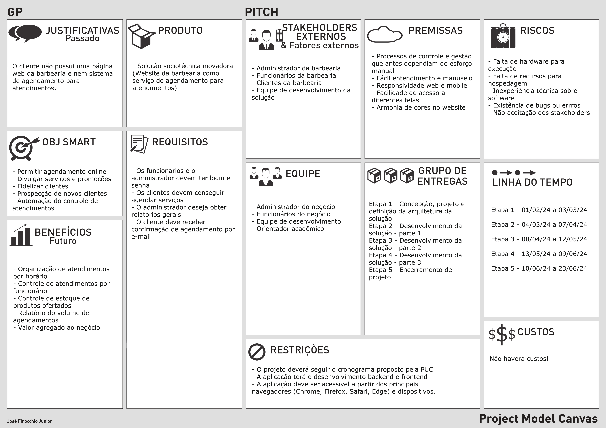
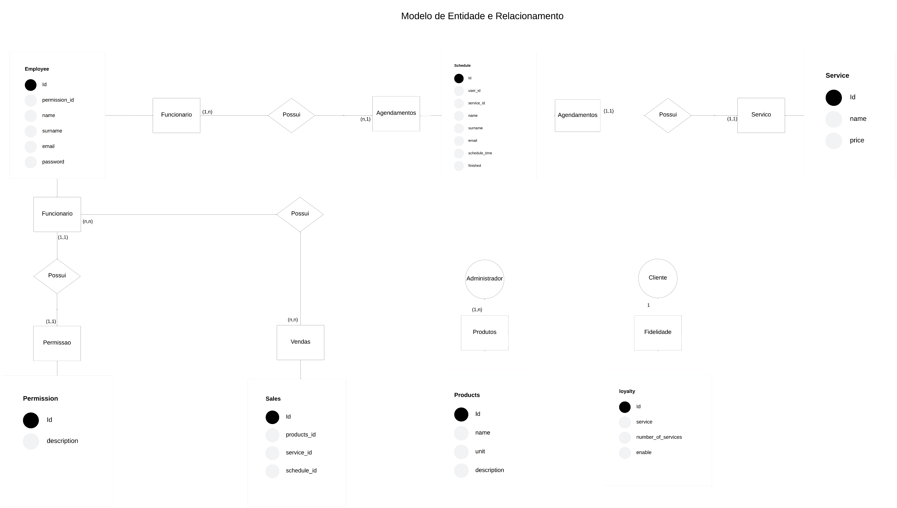

# Especificações do Projeto

A base para a construção do presente projeto consiste na criação de uma aplicacao para agendamento de horários e gerenciamento de uma barbearia, que ofereça aos usuários a possibilidade de agendamento online de servicos ofertados, além de serviços essenciais para gerencialmento da barbearia pelo gestor/dono. A partir de alinhamento com o cliete e consolidação das ideias dos membros da equipe de desenvolvedores, foram levantadas histórias de usuários e requisitos a quem se destina a aplicação.

## Arquitetura e Tecnologias

Diagrama de componentes da solução.

## Tecnologias Utilizadas

- **IDE: Visual Studio Code

- **Ferramentas de comunicação: teams e discord

- **Ferramenta para desenho de tela: Figma

- **Ferramentas de diagramação: Lucidchart

- **Gerenciamento do Projeto: Github Projects

- **Repositório do código fonte: Github

- **Linguagens utilizadas no Front-end: Html, css, javascript

- **Linguagem utilizada no Back-end: 

- **Framework Front-end: Bootstrap

- **Framework para integração entre back-end e banco de dados: 

- **Banco de Dados: MySql
 

## Project Model Canvas

## Personas

### Luiz Eduardo Marinho

- **Idade:** 36 anos
- **Ocupação:** Professor de escola pública
- **Caso de Uso:** Quer agendar um corte de cabelo sem ir pessoalmente ou contactar algum funcionário da barbearia.
- **Necessidade:** O desejo de Luiz é que ele possa de forma prática, simples e agil  fazer um agendamento de corte de cabelo.

### Victor Hugo Catarino Monteiro

- **Idade:** 
- **Ocupação:** Dono da Barbearia Vintage
- **Caso de uso1:** Quer oferecer para seus clientes agendandamento de serviços de sua barbearia de forma on-line.
- **Necessidade1:** O desejo de Victor é que ele possa oferecer agendamento on-line para seus clientes além de poder gerenciar os agendamentos.
- **Caso de uso2:** Quer poder acompanhar e gerenciar o estoque dos produtos utilizados na barbearia de forma on-line.
- **Necessidade2:** O desejo de Victor é que ele possa acompanhar a quantidade e utilização dos produtos da barbaria.

### Alexandre Godoy

- **Idade:** 55 anos
- **Ocupação:** Funcionário da Barbearia.
- **Caso de uso:** Quer poder acompanhar e gerenciaros clientes que agendaram serviços com ele.
- **Necessidade:** O desejo de Alexandre é que ele possa acompanhar os agendamentos dos clientes para poder gerenciar melhor seu tempo.

## Requisitos

As tabelas que se seguem apresentam os requisitos funcionais e não funcionais que detalham o escopo do projeto. Para determinar a prioridade de requisitos, aplicar uma técnica de priorização de requisitos e detalhar como a técnica foi aplicada.

### Requisitos Funcionais

|ID    | Descrição do Requisito  | Prioridade |
|-------|-------------------------|----|
|RF-001|Permitir que os funcionarios efetuem login na aplicação |ALTA|
|RF-002|Permitir que os administradores cadastrem funcionarios e efetuem login na aplicação |ALTA|
|RF-003|Permitir que os funcionarios e administradores redefinem a senha |ALTA|
|RF-004|Permitir que os clientes agendem serviços online | ALTA | 
|RF-005|Permitir que os clientes cancelem seus agendamentos | ALTA | 
|RF-006|Permitir que a barbearia gerencie os agendamentos   | ALTA |
|RF-007|Permitir que a barbearia e o cliente visualizem histórico de serviços agendados e realizados   | ALTA |
|RF-008|Permitir que o administrador possa ofertar algum serviço gratuito para clientes fidelidades (O administrador decidira quantos cortes realizados para se tornar fidelidade)   | MEDIA |
|RF-009|Disponibilizar relatorio para o administrador contendo serviços realizados, produtos vendidos e valores obtidos mensalmente | MÉDIA |
|RF-010|Permitir que a barbearia gerencie o estoque de produtos |MÉDIA|
|RF-011|Enviar e-mail de lembrete para o cliente 1 (uma) hora antes do do horarios agendado |BAIXA| 
|RF-012|Possibilitar a visualização de informações sobre a barbearia (endereço, telefone, horário de funcionamento, etc.) |MÉDIA| 
|RF-013|Seção de contato para dúvidas e sugestões |BAIXA| 
|RF-014|Disponibilização do link das redes sociais da barbearia na plataforma |BAIXA| 

### Requisitos não Funcionais

|ID     | Descrição do Requisito  |Prioridade |
|-------|-------------------------|----|
|RNF-001| O sistema deve ter interface simples e intuitiva, de fácil navegação| MÉDIA | 
|RNF-002| Layout responsivo para adaptação a diferentes dispositivos (celulares, tablets, desktops) |  ALTA | 
|RNF-003| Sistema estável e sem erros |  ALTA |
|RNF-004| O sistema deve funcionar em todos os navegadores).| ALTA | 
|RNF-005| O sistema deve oferer tempo de carregamento rápido das páginas.| MÉDIA | 

## Restrições

O projeto está restrito pelos itens apresentados na tabela a seguir.

|ID| Restrição                                             |
|--|-------------------------------------------------------|
|01| O projeto deverá seguir o cronograma proposto pela PUC |
|02| A aplicação terá o desenvolvimento backend e frontend       |
|03| A aplicação deve ser acessível a partir dos principais navegadores (Chrome, Firefox, Safari, Edge) e dispositivos. |

## Diagrama de Casos de Uso

O diagrama de casos de uso é o próximo passo após a elicitação de requisitos, que utiliza um modelo gráfico e uma tabela com as descrições sucintas dos casos de uso e dos atores. Ele contempla a fronteira do sistema e o detalhamento dos requisitos funcionais com a indicação dos atores, casos de uso e seus relacionamentos. 

As referências abaixo irão auxiliá-lo na geração do artefato “Diagrama de Casos de Uso”.

> **Links Úteis**:
> - [Criando Casos de Uso](https://www.ibm.com/docs/pt-br/elm/6.0?topic=requirements-creating-use-cases)
> - [Como Criar Diagrama de Caso de Uso: Tutorial Passo a Passo](https://gitmind.com/pt/fazer-diagrama-de-caso-uso.html/)
> - [Lucidchart](https://www.lucidchart.com/)
> - [Astah](https://astah.net/)
> - [Diagrams](https://app.diagrams.net/)

## Modelo ER (Projeto Conceitual)

O Modelo ER representa através de um diagrama como as entidades (coisas, objetos) se relacionam entre si na aplicação interativa.

## Projeto da Base de Dados

O projeto da base de dados corresponde à representação das entidades e relacionamentos identificadas no Modelo ER, no formato de tabelas, com colunas e chaves primárias/estrangeiras necessárias para representar corretamente as restrições de integridade.

