# Projeto de Interface

Pré-requisitos: <a href="2-Especificação do Projeto.md"> Documentação de Especificação</a>

## Wireframes

Visão geral da interação do usuário pelas telas do sistema e protótipo interativo das telas com as funcionalidades que fazem parte do sistema (wireframes) via MarvelApp.

Mapa de Fluxo e Wireframes:

**WEB**:

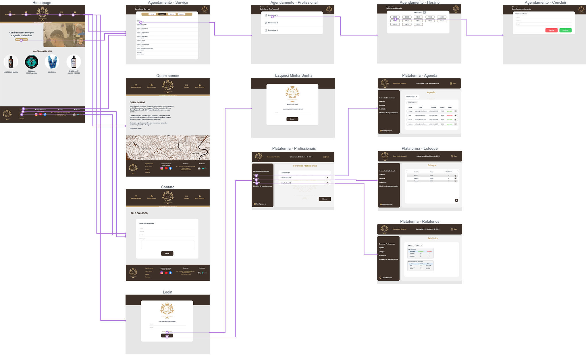

<a href="https://marvelapp.com/prototype/7de3jfh" target="_blank"> Link Wireframe Interativo WEB</a>

Estabelecendo foco em questões como agilidade e usabilidade. O projeto tem identidade visual padronizada em todas as telas e são projetadas para funcionamento de forma responsiva em Desktops e dispositivos móveis utilizando a tecnologia React JS, assim atendendo os requisitos não funcionais RNF-001, RNF-002, RNF-004, RNF-006.

#Tela Homepage:

Atendendo os requisitos funcionais RF-012, RF-014, a tela "Homepage" será a página incial WEB do negócio. É apresentado ao usuário a identidade visual da barbearia, informações de produtos ofertados e caminhos para utilizar demais funcionalidades do sistema. 

#Tela Sobre:
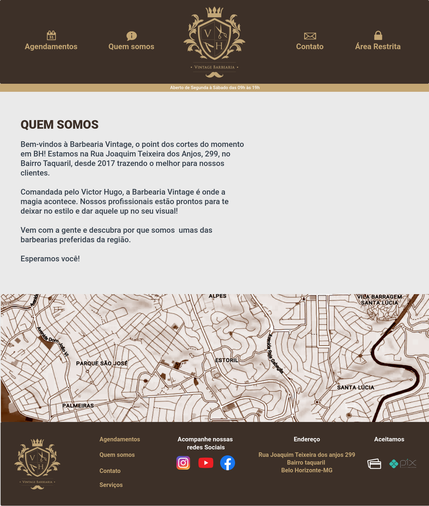
Atendendo os requisitos funcionais RF-012, RF-014, a tela "Sobre" contempla a apresentação do negócio. É apresentado ao usuário um texto apresentativo sobre a barbearia e foto do local. 

#Tela Contato:
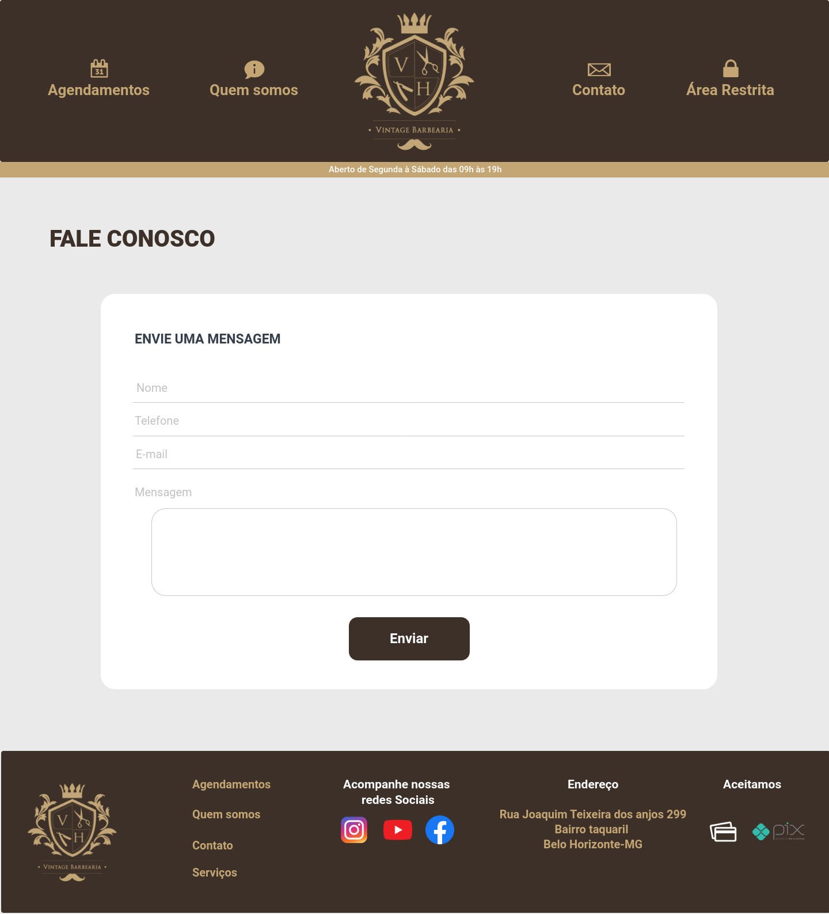
Atendendo os requisitos funcionais RF-013, a tela "Contato" contempla um formulário para contato que qualquer visitante possa enviar uma mensagem ao administrador do negócio. 

#Tela Agendamento:
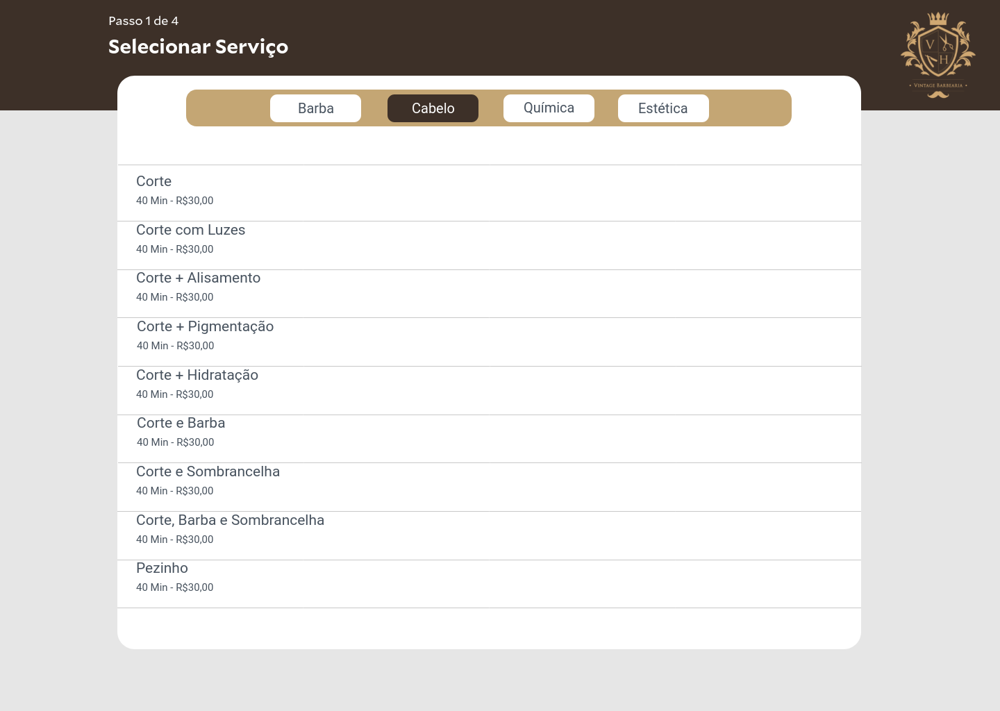
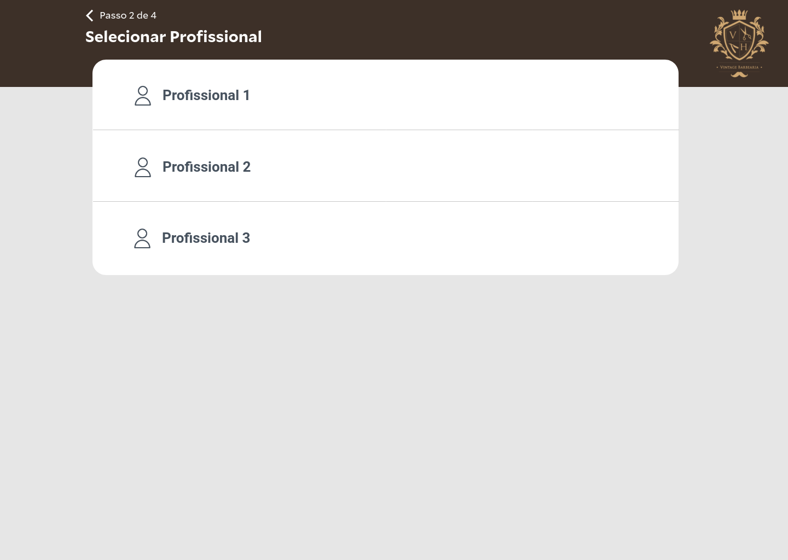
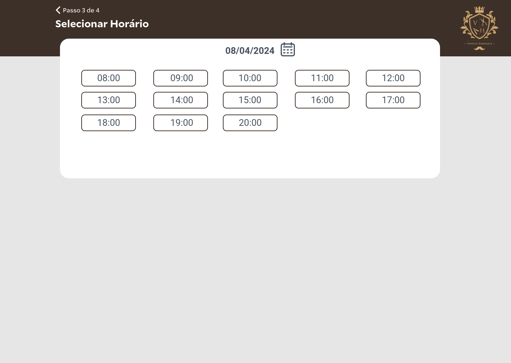
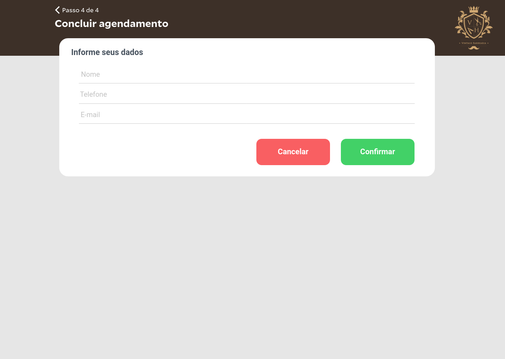
Atendendo os requisitos funcionais RF-004 e RF-005 as telas "Agendamento" permite em quatro passos o agendamento de um serviço junto a um profissional. 

#Tela Login:
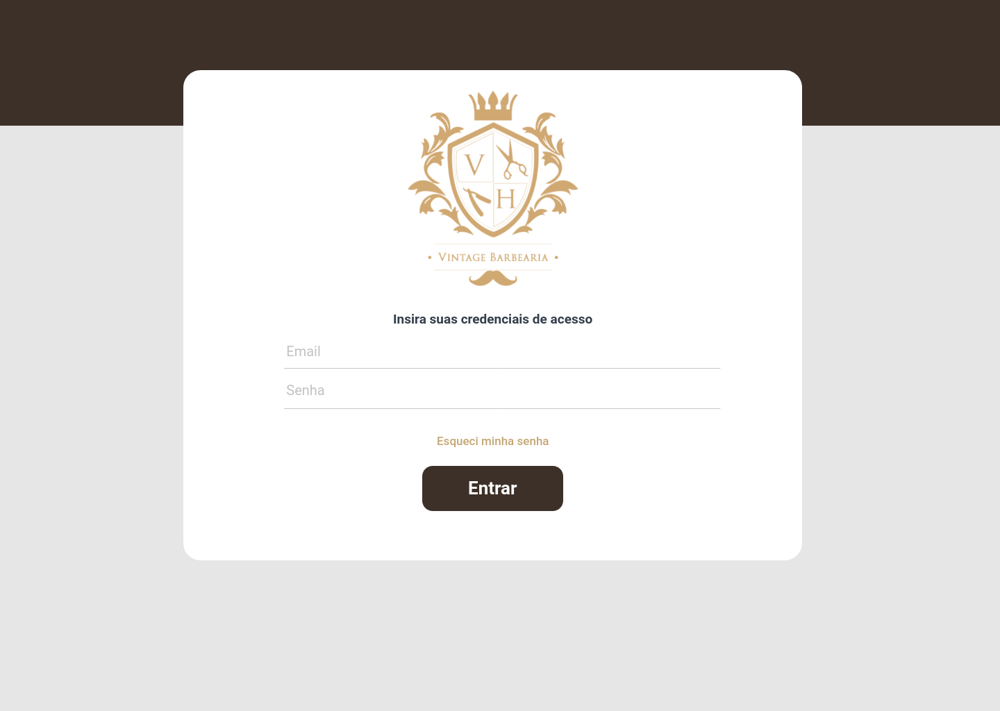
Atendendo os requisitos funcionais RF-001 e RF-002 a tela "Login" permite que os funcionários e administrador do negócio faça autenticação no sistema para gerenciar agendamentos e outras funcionalidades do sistema. 

#Tela Recuperação de senha:
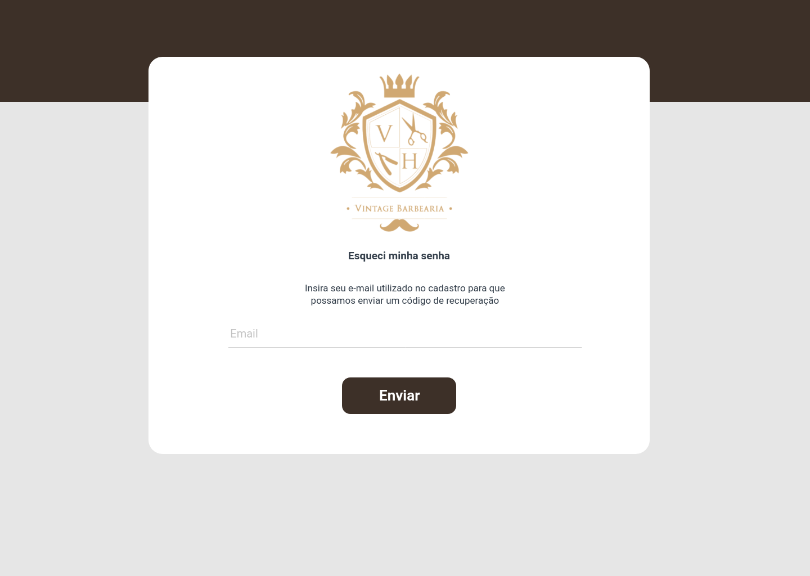
Atendendo os requisitos funcionais RF-003 a tela "Recuperação de senha" permite que os funcionários e administrador do negócio faça a redefinição da senha de acesso em três passos, onde será informado o e-mail do usuário, informado o código recebido por e-mail e a definição da nova senha de acesso. 

#Tela Agendas:
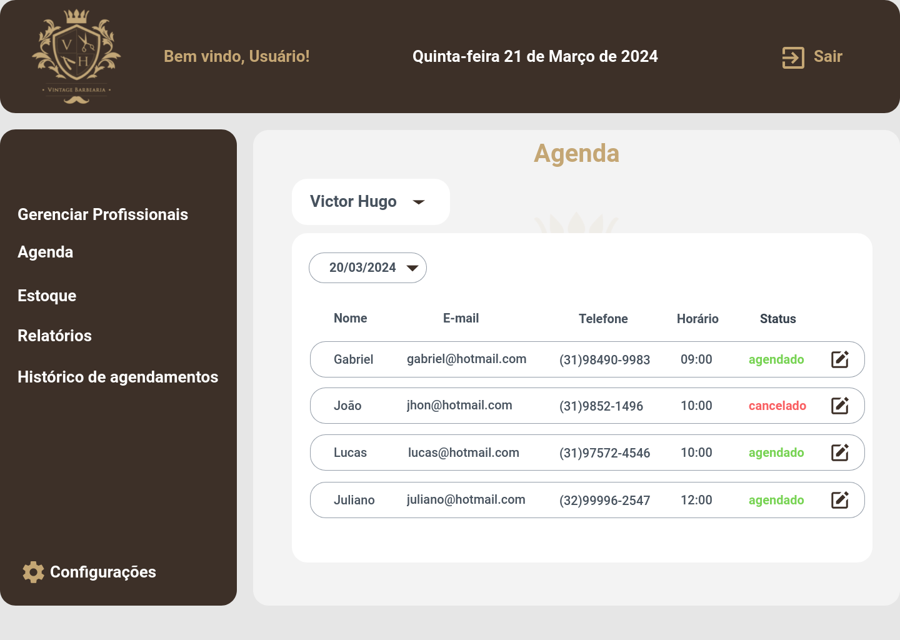
Atendendo os requisitos funcionais RF-006 a tela "Agenda" permite que os funcionários e administrador do negócio faça o gerenciamento dos agendamentos, possibilitando o cancelamento e visualização dos agendamentos a partir da data atual do acesso mais 7 dias posteriores. *Apenas o administrados poderá gerenciar a agenda de todos profissionais

#Tela Profissionais:

Atendendo os requisitos funcionais RF-002 a tela "Profissionais" permite que o administrador do negócio faça o gerenciamento dos profissionais como adicionar, alterar dados, inativar e definir o dia de folga de um profissional. 

#Tela Estoque:
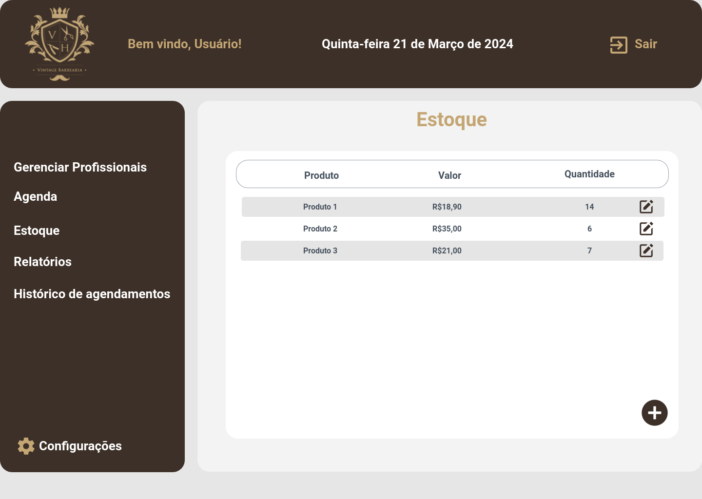
Atendendo os requisitos funcionais RF-010 a tela "Estoque" permite que o administrador do negócio faça o controle de estoque de produtos.

#Tela Relatórios:
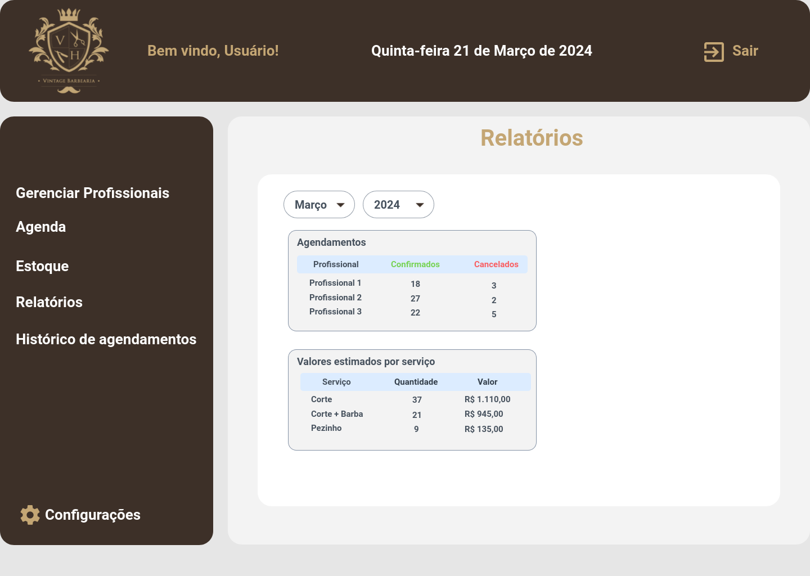
Atendendo os requisitos funcionais RF-009, RF-007, a tela "Relatórios" permite que o administrador do negócio visualize a quantidade de serviços realizados e soma de valores estimados, e também o histórico de serviços realizados por cada profissional.

